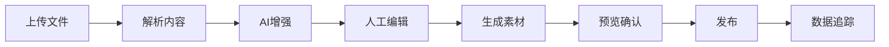
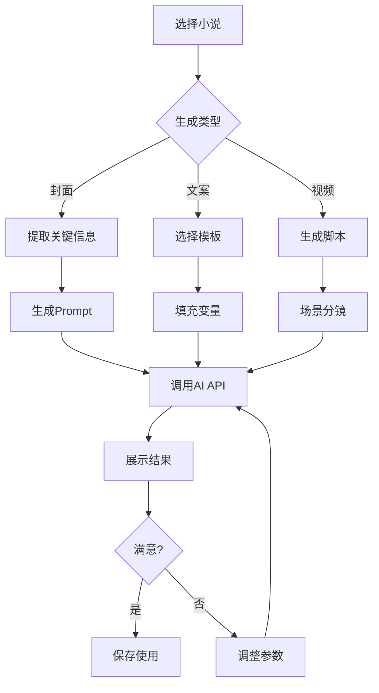

# 小说发布系统 UI 增强设计文档

## 一、系统现状分析

### 已实现功能
- ✅ 基础发布流程（上传→解析→编辑→发布）
- ✅ 主题系统（4种模式）
- ✅ 富文本/Markdown编辑器
- ✅ 通知系统
- ✅ 移动端响应式

### 待改进领域
- 📊 数据可视化缺失
- 🔄 历史记录管理薄弱
- 🎨 缺少视觉素材生成
- 📈 无营销推广支持
- ⚡ 批量操作能力不足

## 二、功能模块设计

### 1. 历史发布记录管理

#### UI设计方案

##### 1.1 列表视图组件架构
```tsx
// 使用 shadcn/ui 组件
- Card + Table 组合（桌面端）
- Card + Stack 布局（移动端）
- Sheet 侧边栏详情
- DropdownMenu 操作菜单
- Badge 状态标识
- Tabs 分类筛选
```

##### 1.2 交互流程
```
主界面
  ├── 顶部筛选栏
  │   ├── Select（状态筛选）
  │   ├── DatePicker（时间范围）
  │   └── SearchInput（关键词搜索）
  ├── 数据表格/卡片
  │   ├── 缩略图
  │   ├── 基础信息
  │   ├── 发布状态
  │   └── 快捷操作
  └── 分页控件
```

##### 1.3 状态管理
```tsx
interface PublishRecord {
  id: string
  novelId: string
  title: string
  cover?: string
  status: 'draft' | 'publishing' | 'published' | 'failed'
  publishTime: Date
  platform: string[]
  version: string
  stats: {
    views: number
    likes: number
    comments: number
  }
}
```

##### 1.4 组件实现
```tsx
// 主列表组件
<Card>
  <CardHeader>
    <div className="flex justify-between items-center">
      <CardTitle>发布历史</CardTitle>
      <div className="flex gap-2">
        <Select> {/* 状态筛选 */} </Select>
        <DatePickerWithRange /> 
        <Input placeholder="搜索..." />
      </div>
    </div>
  </CardHeader>
  <CardContent>
    <DataTable 
      columns={publishColumns}
      data={records}
      pagination
      sorting
      selection
    />
  </CardContent>
</Card>

// 详情侧边栏
<Sheet>
  <SheetContent className="w-[600px]">
    <SheetHeader>
      <SheetTitle>发布详情</SheetTitle>
    </SheetHeader>
    <Tabs defaultValue="info">
      <TabsList className="grid w-full grid-cols-3">
        <TabsTrigger value="info">基本信息</TabsTrigger>
        <TabsTrigger value="versions">版本历史</TabsTrigger>
        <TabsTrigger value="stats">数据统计</TabsTrigger>
      </TabsList>
      {/* 各标签页内容 */}
    </Tabs>
  </SheetContent>
</Sheet>
```

### 2. 小说封面AI生成

#### UI设计方案

##### 2.1 生成流程界面
```tsx
// 三步向导式设计
<Card>
  <CardContent>
    <Stepper currentStep={step}>
      <Step title="提取关键信息" />
      <Step title="生成Prompt" />
      <Step title="选择封面" />
    </Stepper>
    
    {/* Step 1: 信息提取 */}
    <div className="grid grid-cols-2 gap-4">
      <div>
        <Label>主角特征</Label>
        <Textarea value={protagonist} />
      </div>
      <div>
        <Label>场景描述</Label>
        <Textarea value={scene} />
      </div>
    </div>
    
    {/* Step 2: Prompt编辑器 */}
    <div className="space-y-4">
      <div className="flex gap-2">
        <Badge>奇幻</Badge>
        <Badge>古风</Badge>
        <Badge>+添加标签</Badge>
      </div>
      <Textarea 
        value={prompt}
        className="min-h-[150px]"
      />
      <div className="flex gap-2">
        <Button variant="outline">
          <Sparkles className="mr-2 h-4 w-4" />
          优化Prompt
        </Button>
        <Button>生成封面</Button>
      </div>
    </div>
    
    {/* Step 3: 封面选择 */}
    <div className="grid grid-cols-3 gap-4">
      {covers.map(cover => (
        <Card className="cursor-pointer hover:ring-2">
          <CardContent className="p-2">
            <AspectRatio ratio={3/4}>
              
            </AspectRatio>
            <div className="flex justify-between mt-2">
              <Button size="sm" variant="ghost">
                <Download className="h-4 w-4" />
              </Button>
              <Button size="sm" variant="ghost">
                <Edit className="h-4 w-4" />
              </Button>
            </div>
          </CardContent>
        </Card>
      ))}
    </div>
  </CardContent>
</Card>
```

##### 2.2 高级编辑器
```tsx
// 使用 Dialog + Tabs 组合
<Dialog>
  <DialogContent className="max-w-4xl">
    <Tabs>
      <TabsList>
        <TabsTrigger value="prompt">Prompt编辑</TabsTrigger>
        <TabsTrigger value="style">风格设置</TabsTrigger>
        <TabsTrigger value="adjust">图像调整</TabsTrigger>
      </TabsList>
      
      {/* Prompt编辑标签页 */}
      <TabsContent value="prompt">
        <div className="grid grid-cols-[1fr_300px] gap-4">
          <div>
            <MonacoEditor // 代码编辑器风格
              language="markdown"
              value={prompt}
              options={{
                minimap: { enabled: false },
                wordWrap: 'on'
              }}
            />
          </div>
          <div className="space-y-4">
            <Card>
              <CardHeader>
                <CardTitle className="text-sm">Prompt模板</CardTitle>
              </CardHeader>
              <CardContent>
                <RadioGroup>
                  <div className="flex items-center space-x-2">
                    <RadioGroupItem value="fantasy" />
                    <Label>奇幻冒险</Label>
                  </div>
                  <div className="flex items-center space-x-2">
                    <RadioGroupItem value="romance" />
                    <Label>浪漫言情</Label>
                  </div>
                </RadioGroup>
              </CardContent>
            </Card>
          </div>
        </div>
      </TabsContent>
      
      {/* 风格设置标签页 */}
      <TabsContent value="style">
        <div className="space-y-4">
          <div className="grid grid-cols-2 gap-4">
            <div>
              <Label>画风</Label>
              <Select>
                <SelectTrigger>
                  <SelectValue placeholder="选择画风" />
                </SelectTrigger>
                <SelectContent>
                  <SelectItem value="anime">动漫风</SelectItem>
                  <SelectItem value="realistic">写实风</SelectItem>
                  <SelectItem value="watercolor">水彩风</SelectItem>
                </SelectContent>
              </Select>
            </div>
            <div>
              <Label>色调</Label>
              <Select>
                <SelectTrigger>
                  <SelectValue placeholder="选择色调" />
                </SelectTrigger>
                <SelectContent>
                  <SelectItem value="warm">暖色调</SelectItem>
                  <SelectItem value="cold">冷色调</SelectItem>
                  <SelectItem value="neutral">中性色调</SelectItem>
                </SelectContent>
              </Select>
            </div>
          </div>
          <div>
            <Label>参考图片</Label>
            <div className="grid grid-cols-4 gap-2 mt-2">
              {referenceImages.map(img => (
                <div className="relative group">
                  <AspectRatio ratio={1}>
                    
                  </AspectRatio>
                  <Button
                    size="icon"
                    variant="destructive"
                    className="absolute top-1 right-1 h-6 w-6 opacity-0 group-hover:opacity-100"
                  >
                    <X className="h-3 w-3" />
                  </Button>
                </div>
              ))}
              <Button variant="dashed" className="h-full">
                <Plus className="h-4 w-4" />
              </Button>
            </div>
          </div>
        </div>
      </TabsContent>
    </Tabs>
  </DialogContent>
</Dialog>
```

### 3. 推广素材生成

#### UI设计方案

##### 3.1 素材中心布局
```tsx
<div className="grid grid-cols-12 gap-6">
  {/* 左侧导航 */}
  <div className="col-span-3">
    <Card>
      <CardContent className="p-4">
        <nav className="space-y-2">
          <Button variant="ghost" className="w-full justify-start">
            <FileText className="mr-2 h-4 w-4" />
            营销文案
          </Button>
          <Button variant="ghost" className="w-full justify-start">
            <Image className="mr-2 h-4 w-4" />
            社交媒体图片
          </Button>
          <Button variant="ghost" className="w-full justify-start">
            <Video className="mr-2 h-4 w-4" />
            短视频脚本
          </Button>
          <Button variant="ghost" className="w-full justify-start">
            <Users className="mr-2 h-4 w-4" />
            受众分析
          </Button>
        </nav>
      </CardContent>
    </Card>
  </div>
  
  {/* 主内容区 */}
  <div className="col-span-9">
    <Card>
      <CardHeader>
        <div className="flex justify-between items-center">
          <CardTitle>营销文案生成</CardTitle>
          <Button>
            <Sparkles className="mr-2 h-4 w-4" />
            AI生成
          </Button>
        </div>
      </CardHeader>
      <CardContent>
        {/* 文案模板选择 */}
        <div className="grid grid-cols-3 gap-4 mb-6">
          {templates.map(template => (
            <Card 
              className="cursor-pointer hover:shadow-lg transition-shadow"
              onClick={() => selectTemplate(template)}
            >
              <CardHeader>
                <CardTitle className="text-sm">{template.name}</CardTitle>
                <CardDescription>{template.description}</CardDescription>
              </CardHeader>
              <CardContent>
                <Badge variant="outline">{template.platform}</Badge>
              </CardContent>
            </Card>
          ))}
        </div>
        
        {/* 生成结果展示 */}
        <div className="space-y-4">
          {generatedContent.map(content => (
            <Card>
              <CardHeader>
                <div className="flex justify-between items-center">
                  <div className="flex items-center gap-2">
                    <Badge>{content.platform}</Badge>
                    <span className="text-sm text-muted-foreground">
                      {content.wordCount}字
                    </span>
                  </div>
                  <div className="flex gap-2">
                    <Button size="sm" variant="ghost">
                      <Copy className="h-4 w-4" />
                    </Button>
                    <Button size="sm" variant="ghost">
                      <Edit className="h-4 w-4" />
                    </Button>
                    <Button size="sm" variant="ghost">
                      <Download className="h-4 w-4" />
                    </Button>
                  </div>
                </div>
              </CardHeader>
              <CardContent>
                <p className="text-sm">{content.text}</p>
              </CardContent>
            </Card>
          ))}
        </div>
      </CardContent>
    </Card>
  </div>
</div>
```

##### 3.2 社交媒体图片生成器
```tsx
<Card>
  <CardContent className="p-6">
    <div className="grid grid-cols-[1fr_400px] gap-6">
      {/* 编辑区 */}
      <div className="space-y-4">
        <div>
          <Label>选择模板</Label>
          <ScrollArea className="h-32 mt-2">
            <div className="flex gap-2">
              {imageTemplates.map(template => (
                <div 
                  className="flex-shrink-0 w-20 h-20 rounded border-2 cursor-pointer hover:border-primary"
                  onClick={() => setSelectedTemplate(template)}
                >
                  
                </div>
              ))}
            </div>
          </ScrollArea>
        </div>
        
        <div>
          <Label>标题文字</Label>
          <Input value={title} onChange={(e) => setTitle(e.target.value)} />
        </div>
        
        <div>
          <Label>副标题</Label>
          <Input value={subtitle} onChange={(e) => setSubtitle(e.target.value)} />
        </div>
        
        <div className="grid grid-cols-2 gap-4">
          <div>
            <Label>字体</Label>
            <Select>
              <SelectTrigger>
                <SelectValue />
              </SelectTrigger>
              <SelectContent>
                <SelectItem value="serif">衬线体</SelectItem>
                <SelectItem value="sans">无衬线</SelectItem>
                <SelectItem value="script">手写体</SelectItem>
              </SelectContent>
            </Select>
          </div>
          <div>
            <Label>配色方案</Label>
            <Select>
              <SelectTrigger>
                <SelectValue />
              </SelectTrigger>
              <SelectContent>
                <SelectItem value="warm">温暖</SelectItem>
                <SelectItem value="cool">清冷</SelectItem>
                <SelectItem value="vibrant">鲜艳</SelectItem>
              </SelectContent>
            </Select>
          </div>
        </div>
        
        <div>
          <Label>背景图片</Label>
          <div className="mt-2">
            <div className="border-2 border-dashed rounded-lg p-8 text-center">
              <Upload className="mx-auto h-8 w-8 text-muted-foreground" />
              <p className="mt-2 text-sm text-muted-foreground">
                拖拽或点击上传背景图片
              </p>
            </div>
          </div>
        </div>
      </div>
      
      {/* 预览区 */}
      <div className="space-y-4">
        <div>
          <Label>预览</Label>
          <Card className="mt-2">
            <AspectRatio ratio={1}>
              <canvas id="preview-canvas" className="w-full h-full" />
            </AspectRatio>
          </Card>
        </div>
        
        <div className="grid grid-cols-2 gap-2">
          <Button variant="outline">
            <RotateCw className="mr-2 h-4 w-4" />
            重新生成
          </Button>
          <Button>
            <Download className="mr-2 h-4 w-4" />
            下载图片
          </Button>
        </div>
        
        <div>
          <Label>尺寸预设</Label>
          <RadioGroup defaultValue="instagram" className="mt-2">
            <div className="flex items-center space-x-2">
              <RadioGroupItem value="instagram" />
              <Label>Instagram (1:1)</Label>
            </div>
            <div className="flex items-center space-x-2">
              <RadioGroupItem value="twitter" />
              <Label>Twitter (16:9)</Label>
            </div>
            <div className="flex items-center space-x-2">
              <RadioGroupItem value="wechat" />
              <Label>微信公众号 (2.35:1)</Label>
            </div>
          </RadioGroup>
        </div>
      </div>
    </div>
  </CardContent>
</Card>
```

### 4. 数据分析仪表板

#### UI设计方案

##### 4.1 Dashboard主布局
```tsx
<div className="space-y-6">
  {/* 顶部统计卡片 */}
  <div className="grid grid-cols-1 md:grid-cols-2 lg:grid-cols-4 gap-4">
    <Card>
      <CardHeader className="pb-2">
        <CardTitle className="text-sm font-medium text-muted-foreground">
          总发布数
        </CardTitle>
      </CardHeader>
      <CardContent>
        <div className="text-2xl font-bold">128</div>
        <p className="text-xs text-muted-foreground">
          <span className="text-green-600">↑ 12%</span> 较上月
        </p>
      </CardContent>
    </Card>
    
    <Card>
      <CardHeader className="pb-2">
        <CardTitle className="text-sm font-medium text-muted-foreground">
          总阅读量
        </CardTitle>
      </CardHeader>
      <CardContent>
        <div className="text-2xl font-bold">45.2K</div>
        <p className="text-xs text-muted-foreground">
          <span className="text-green-600">↑ 8%</span> 较上月
        </p>
      </CardContent>
    </Card>
    
    <Card>
      <CardHeader className="pb-2">
        <CardTitle className="text-sm font-medium text-muted-foreground">
          平均完读率
        </CardTitle>
      </CardHeader>
      <CardContent>
        <div className="text-2xl font-bold">68.5%</div>
        <p className="text-xs text-muted-foreground">
          <span className="text-red-600">↓ 2%</span> 较上月
        </p>
      </CardContent>
    </Card>
    
    <Card>
      <CardHeader className="pb-2">
        <CardTitle className="text-sm font-medium text-muted-foreground">
          本月收益
        </CardTitle>
      </CardHeader>
      <CardContent>
        <div className="text-2xl font-bold">¥3,842</div>
        <p className="text-xs text-muted-foreground">
          <span className="text-green-600">↑ 15%</span> 较上月
        </p>
      </CardContent>
    </Card>
  </div>
  
  {/* 图表区域 */}
  <div className="grid grid-cols-1 lg:grid-cols-2 gap-6">
    <Card>
      <CardHeader>
        <div className="flex justify-between items-center">
          <CardTitle>阅读趋势</CardTitle>
          <Select defaultValue="7d">
            <SelectTrigger className="w-[120px]">
              <SelectValue />
            </SelectTrigger>
            <SelectContent>
              <SelectItem value="7d">最近7天</SelectItem>
              <SelectItem value="30d">最近30天</SelectItem>
              <SelectItem value="90d">最近90天</SelectItem>
            </SelectContent>
          </Select>
        </div>
      </CardHeader>
      <CardContent>
        <ResponsiveContainer width="100%" height={300}>
          <LineChart data={readingTrend}>
            <CartesianGrid strokeDasharray="3 3" />
            <XAxis dataKey="date" />
            <YAxis />
            <Tooltip />
            <Line type="monotone" dataKey="views" stroke="#8884d8" />
            <Line type="monotone" dataKey="readers" stroke="#82ca9d" />
          </LineChart>
        </ResponsiveContainer>
      </CardContent>
    </Card>
    
    <Card>
      <CardHeader>
        <CardTitle>分类分布</CardTitle>
      </CardHeader>
      <CardContent>
        <ResponsiveContainer width="100%" height={300}>
          <PieChart>
            <Pie
              data={categoryData}
              cx="50%"
              cy="50%"
              labelLine={false}
              label={renderCustomizedLabel}
              outerRadius={80}
              fill="#8884d8"
              dataKey="value"
            >
              {categoryData.map((entry, index) => (
                <Cell key={`cell-${index}`} fill={COLORS[index % COLORS.length]} />
              ))}
            </Pie>
            <Tooltip />
          </PieChart>
        </ResponsiveContainer>
      </CardContent>
    </Card>
  </div>
  
  {/* 热门作品列表 */}
  <Card>
    <CardHeader>
      <div className="flex justify-between items-center">
        <CardTitle>热门作品</CardTitle>
        <Button variant="outline" size="sm">
          查看全部
          <ChevronRight className="ml-1 h-4 w-4" />
        </Button>
      </div>
    </CardHeader>
    <CardContent>
      <Table>
        <TableHeader>
          <TableRow>
            <TableHead>作品名称</TableHead>
            <TableHead>发布时间</TableHead>
            <TableHead className="text-right">阅读量</TableHead>
            <TableHead className="text-right">完读率</TableHead>
            <TableHead className="text-right">收藏数</TableHead>
            <TableHead className="text-right">评分</TableHead>
          </TableRow>
        </TableHeader>
        <TableBody>
          {topNovels.map((novel) => (
            <TableRow key={novel.id}>
              <TableCell className="font-medium">{novel.title}</TableCell>
              <TableCell>{novel.publishDate}</TableCell>
              <TableCell className="text-right">{novel.views}</TableCell>
              <TableCell className="text-right">{novel.completionRate}%</TableCell>
              <TableCell className="text-right">{novel.favorites}</TableCell>
              <TableCell className="text-right">
                <div className="flex items-center justify-end">
                  <Star className="h-4 w-4 text-yellow-500 mr-1" />
                  {novel.rating}
                </div>
              </TableCell>
            </TableRow>
          ))}
        </TableBody>
      </Table>
    </CardContent>
  </Card>
</div>
```

##### 4.2 详细分析页面
```tsx
<Tabs defaultValue="overview" className="space-y-4">
  <TabsList>
    <TabsTrigger value="overview">概览</TabsTrigger>
    <TabsTrigger value="readers">读者分析</TabsTrigger>
    <TabsTrigger value="content">内容分析</TabsTrigger>
    <TabsTrigger value="revenue">收益报表</TabsTrigger>
  </TabsList>
  
  <TabsContent value="readers" className="space-y-4">
    <div className="grid grid-cols-1 lg:grid-cols-3 gap-6">
      {/* 读者画像 */}
      <Card>
        <CardHeader>
          <CardTitle>读者画像</CardTitle>
        </CardHeader>
        <CardContent className="space-y-4">
          <div>
            <div className="flex justify-between text-sm">
              <span>年龄分布</span>
            </div>
            <div className="space-y-2 mt-2">
              <div className="flex items-center gap-2">
                <span className="text-xs w-12">18-24</span>
                <Progress value={35} className="flex-1" />
                <span className="text-xs w-8">35%</span>
              </div>
              <div className="flex items-center gap-2">
                <span className="text-xs w-12">25-34</span>
                <Progress value={45} className="flex-1" />
                <span className="text-xs w-8">45%</span>
              </div>
              <div className="flex items-center gap-2">
                <span className="text-xs w-12">35+</span>
                <Progress value={20} className="flex-1" />
                <span className="text-xs w-8">20%</span>
              </div>
            </div>
          </div>
          
          <Separator />
          
          <div>
            <div className="flex justify-between text-sm">
              <span>性别分布</span>
            </div>
            <div className="flex gap-4 mt-2">
              <div className="flex-1 text-center">
                <div className="text-2xl font-bold">62%</div>
                <div className="text-xs text-muted-foreground">女性</div>
              </div>
              <div className="flex-1 text-center">
                <div className="text-2xl font-bold">38%</div>
                <div className="text-xs text-muted-foreground">男性</div>
              </div>
            </div>
          </div>
        </CardContent>
      </Card>
      
      {/* 阅读习惯 */}
      <Card>
        <CardHeader>
          <CardTitle>阅读习惯</CardTitle>
        </CardHeader>
        <CardContent>
          <div className="space-y-4">
            <div>
              <div className="flex justify-between text-sm mb-2">
                <span>活跃时段</span>
              </div>
              <ResponsiveContainer width="100%" height={100}>
                <BarChart data={hourlyActivity}>
                  <Bar dataKey="value" fill="#8884d8" />
                  <XAxis dataKey="hour" />
                </BarChart>
              </ResponsiveContainer>
            </div>
            
            <Separator />
            
            <div>
              <div className="text-sm mb-2">平均阅读时长</div>
              <div className="text-2xl font-bold">23分钟</div>
              <div className="text-xs text-muted-foreground">每次会话</div>
            </div>
            
            <div>
              <div className="text-sm mb-2">章节完成率</div>
              <div className="text-2xl font-bold">78%</div>
              <div className="text-xs text-muted-foreground">平均值</div>
            </div>
          </div>
        </CardContent>
      </Card>
      
      {/* 互动数据 */}
      <Card>
        <CardHeader>
          <CardTitle>互动数据</CardTitle>
        </CardHeader>
        <CardContent>
          <div className="space-y-4">
            <div className="flex items-center justify-between">
              <div className="flex items-center gap-2">
                <Heart className="h-4 w-4 text-red-500" />
                <span className="text-sm">收藏率</span>
              </div>
              <span className="font-bold">12.3%</span>
            </div>
            
            <div className="flex items-center justify-between">
              <div className="flex items-center gap-2">
                <MessageCircle className="h-4 w-4 text-blue-500" />
                <span className="text-sm">评论率</span>
              </div>
              <span className="font-bold">8.7%</span>
            </div>
            
            <div className="flex items-center justify-between">
              <div className="flex items-center gap-2">
                <Share2 className="h-4 w-4 text-green-500" />
                <span className="text-sm">分享率</span>
              </div>
              <span className="font-bold">5.2%</span>
            </div>
            
            <Separator />
            
            <div>
              <div className="text-sm mb-2">热门评论标签</div>
              <div className="flex flex-wrap gap-2">
                <Badge variant="secondary">精彩</Badge>
                <Badge variant="secondary">感人</Badge>
                <Badge variant="secondary">期待续集</Badge>
                <Badge variant="secondary">文笔好</Badge>
              </div>
            </div>
          </div>
        </CardContent>
      </Card>
    </div>
  </TabsContent>
</Tabs>
```

### 5. 批量操作功能

#### UI设计方案

##### 5.1 批量上传界面
```tsx
<Card>
  <CardHeader>
    <CardTitle>批量上传</CardTitle>
    <CardDescription>
      支持拖拽多个文件或文件夹上传，自动识别小说格式
    </CardDescription>
  </CardHeader>
  <CardContent>
    {/* 拖拽区域 */}
    <div
      className={cn(
        "border-2 border-dashed rounded-lg p-12 text-center transition-colors",
        isDragging && "border-primary bg-primary/5"
      )}
      onDragOver={handleDragOver}
      onDragLeave={handleDragLeave}
      onDrop={handleDrop}
    >
      <Upload className="mx-auto h-12 w-12 text-muted-foreground" />
      <h3 className="mt-4 text-lg font-semibold">拖拽文件到此处</h3>
      <p className="mt-2 text-sm text-muted-foreground">
        或点击选择多个文件（支持 .txt, .md, .docx）
      </p>
      <Button className="mt-4">
        选择文件
      </Button>
    </div>
    
    {/* 文件列表 */}
    {files.length > 0 && (
      <div className="mt-6">
        <div className="flex justify-between items-center mb-4">
          <h4 className="text-sm font-medium">
            待上传文件 ({files.length})
          </h4>
          <div className="flex gap-2">
            <Button variant="outline" size="sm" onClick={clearAll}>
              清空列表
            </Button>
            <Button size="sm" onClick={startUpload}>
              开始上传
            </Button>
          </div>
        </div>
        
        <ScrollArea className="h-[400px]">
          <div className="space-y-2">
            {files.map((file, index) => (
              <Card key={index}>
                <CardContent className="p-4">
                  <div className="flex items-center justify-between">
                    <div className="flex items-center gap-3">
                      <FileText className="h-8 w-8 text-muted-foreground" />
                      <div>
                        <p className="font-medium">{file.name}</p>
                        <p className="text-sm text-muted-foreground">
                          {formatFileSize(file.size)}
                        </p>
                      </div>
                    </div>
                    
                    <div className="flex items-center gap-2">
                      {file.status === 'uploading' && (
                        <div className="flex items-center gap-2">
                          <Progress value={file.progress} className="w-24" />
                          <span className="text-sm">{file.progress}%</span>
                        </div>
                      )}
                      {file.status === 'success' && (
                        <CheckCircle className="h-5 w-5 text-green-500" />
                      )}
                      {file.status === 'error' && (
                        <AlertCircle className="h-5 w-5 text-red-500" />
                      )}
                      <Button
                        size="icon"
                        variant="ghost"
                        onClick={() => removeFile(index)}
                      >
                        <X className="h-4 w-4" />
                      </Button>
                    </div>
                  </div>
                  
                  {file.status === 'error' && (
                    <Alert className="mt-2">
                      <AlertDescription>{file.error}</AlertDescription>
                    </Alert>
                  )}
                </CardContent>
              </Card>
            ))}
          </div>
        </ScrollArea>
      </div>
    )}
  </CardContent>
</Card>
```

##### 5.2 批量编辑界面
```tsx
<div className="space-y-6">
  {/* 选择栏 */}
  <Card>
    <CardContent className="p-4">
      <div className="flex items-center justify-between">
        <div className="flex items-center gap-4">
          <Checkbox
            checked={selectAll}
            onCheckedChange={handleSelectAll}
          />
          <span className="text-sm">
            已选择 {selectedCount} / {totalCount} 项
          </span>
        </div>
        
        <div className="flex gap-2">
          <Button variant="outline" size="sm" disabled={selectedCount === 0}>
            <Edit className="mr-2 h-4 w-4" />
            批量编辑
          </Button>
          <Button variant="outline" size="sm" disabled={selectedCount === 0}>
            <Tag className="mr-2 h-4 w-4" />
            批量标签
          </Button>
          <Button variant="outline" size="sm" disabled={selectedCount === 0}>
            <Folder className="mr-2 h-4 w-4" />
            批量分类
          </Button>
        </div>
      </div>
    </CardContent>
  </Card>
  
  {/* 批量编辑面板 */}
  <Collapsible open={isEditPanelOpen}>
    <CollapsibleContent>
      <Card>
        <CardHeader>
          <CardTitle>批量编辑选项</CardTitle>
        </CardHeader>
        <CardContent>
          <div className="grid grid-cols-2 gap-6">
            <div className="space-y-4">
              <div>
                <Label>作者</Label>
                <div className="flex gap-2 mt-2">
                  <Input placeholder="留空则不修改" />
                  <Button variant="outline" size="icon">
                    <RotateCw className="h-4 w-4" />
                  </Button>
                </div>
              </div>
              
              <div>
                <Label>分类</Label>
                <Select>
                  <SelectTrigger>
                    <SelectValue placeholder="选择分类" />
                  </SelectTrigger>
                  <SelectContent>
                    <SelectItem value="fantasy">奇幻</SelectItem>
                    <SelectItem value="romance">言情</SelectItem>
                    <SelectItem value="history">历史</SelectItem>
                  </SelectContent>
                </Select>
              </div>
              
              <div>
                <Label>标签</Label>
                <div className="flex flex-wrap gap-2 mt-2">
                  <Badge variant="secondary">
                    热血
                    <X className="ml-1 h-3 w-3 cursor-pointer" />
                  </Badge>
                  <Badge variant="secondary">
                    冒险
                    <X className="ml-1 h-3 w-3 cursor-pointer" />
                  </Badge>
                  <Button variant="outline" size="sm">
                    <Plus className="h-3 w-3" />
                  </Button>
                </div>
              </div>
            </div>
            
            <div className="space-y-4">
              <div>
                <Label>发布状态</Label>
                <RadioGroup defaultValue="draft">
                  <div className="flex items-center space-x-2">
                    <RadioGroupItem value="draft" />
                    <Label>草稿</Label>
                  </div>
                  <div className="flex items-center space-x-2">
                    <RadioGroupItem value="published" />
                    <Label>已发布</Label>
                  </div>
                </RadioGroup>
              </div>
              
              <div>
                <Label>定时发布</Label>
                <DateTimePicker />
              </div>
            </div>
          </div>
          
          <div className="flex justify-end gap-2 mt-6">
            <Button variant="outline" onClick={() => setIsEditPanelOpen(false)}>
              取消
            </Button>
            <Button onClick={applyBatchEdit}>
              应用到选中项
            </Button>
          </div>
        </CardContent>
      </Card>
    </CollapsibleContent>
  </Collapsible>
  
  {/* 小说列表 */}
  <Card>
    <CardContent className="p-0">
      <Table>
        <TableHeader>
          <TableRow>
            <TableHead className="w-12">
              <Checkbox />
            </TableHead>
            <TableHead>标题</TableHead>
            <TableHead>作者</TableHead>
            <TableHead>分类</TableHead>
            <TableHead>章节数</TableHead>
            <TableHead>状态</TableHead>
            <TableHead>更新时间</TableHead>
            <TableHead className="text-right">操作</TableHead>
          </TableRow>
        </TableHeader>
        <TableBody>
          {novels.map((novel) => (
            <TableRow key={novel.id}>
              <TableCell>
                <Checkbox
                  checked={selectedNovels.includes(novel.id)}
                  onCheckedChange={() => toggleSelect(novel.id)}
                />
              </TableCell>
              <TableCell className="font-medium">{novel.title}</TableCell>
              <TableCell>{novel.author}</TableCell>
              <TableCell>
                <Badge variant="outline">{novel.category}</Badge>
              </TableCell>
              <TableCell>{novel.chapterCount}</TableCell>
              <TableCell>
                <Badge variant={novel.status === 'published' ? 'default' : 'secondary'}>
                  {novel.status === 'published' ? '已发布' : '草稿'}
                </Badge>
              </TableCell>
              <TableCell>{novel.updateTime}</TableCell>
              <TableCell className="text-right">
                <DropdownMenu>
                  <DropdownMenuTrigger asChild>
                    <Button variant="ghost" size="icon">
                      <MoreVertical className="h-4 w-4" />
                    </Button>
                  </DropdownMenuTrigger>
                  <DropdownMenuContent align="end">
                    <DropdownMenuItem>编辑</DropdownMenuItem>
                    <DropdownMenuItem>预览</DropdownMenuItem>
                    <DropdownMenuItem>发布</DropdownMenuItem>
                    <DropdownMenuSeparator />
                    <DropdownMenuItem className="text-red-600">
                      删除
                    </DropdownMenuItem>
                  </DropdownMenuContent>
                </DropdownMenu>
              </TableCell>
            </TableRow>
          ))}
        </TableBody>
      </Table>
    </CardContent>
  </Card>
</div>
```

## 三、组件架构设计

### 核心组件层级
```
App
├── Layout
│   ├── Header
│   │   ├── Navigation
│   │   ├── UserMenu
│   │   └── NotificationCenter
│   ├── Sidebar
│   │   ├── MainNav
│   │   ├── QuickActions
│   │   └── StorageIndicator
│   └── MainContent
│       ├── RouteOutlet
│       └── GlobalToast
├── Features
│   ├── Dashboard
│   │   ├── StatsOverview
│   │   ├── Charts
│   │   └── ActivityFeed
│   ├── NovelManager
│   │   ├── NovelList
│   │   ├── NovelEditor
│   │   └── PublishFlow
│   ├── AssetGenerator
│   │   ├── CoverGenerator
│   │   ├── CopyWriter
│   │   └── MediaTemplates
│   └── Analytics
│       ├── ReaderInsights
│       ├── ContentPerformance
│       └── RevenueReports
└── Common
    ├── DataTable
    ├── FormBuilder
    ├── FileUploader
    └── AIGenerator
```

### 状态管理架构
```typescript
// 使用 Zustand 进行状态管理
interface AppState {
  // 用户状态
  user: User | null
  
  // 小说管理
  novels: Novel[]
  selectedNovel: Novel | null
  publishQueue: PublishTask[]
  
  // UI状态
  theme: Theme
  sidebarCollapsed: boolean
  activeFilters: FilterState
  
  // 操作
  actions: {
    // 小说操作
    loadNovels: () => Promise<void>
    createNovel: (data: NovelInput) => Promise<Novel>
    updateNovel: (id: string, data: Partial<Novel>) => Promise<void>
    publishNovel: (id: string, options: PublishOptions) => Promise<void>
    
    // 批量操作
    batchUpdate: (ids: string[], data: Partial<Novel>) => Promise<void>
    batchPublish: (ids: string[], options: PublishOptions) => Promise<void>
    
    // AI生成
    generateCover: (novelId: string, prompt?: string) => Promise<Cover>
    generateCopy: (novelId: string, template: string) => Promise<Copy>
    
    // 分析
    fetchAnalytics: (timeRange: TimeRange) => Promise<Analytics>
  }
}
```

## 四、交互流程设计

### 1. 完整发布流程


### 2. AI生成流程


## 五、响应式设计策略

### 断点定义
```scss
// Tailwind CSS 默认断点
sm: 640px   // 手机横屏
md: 768px   // 平板竖屏
lg: 1024px  // 平板横屏/小笔记本
xl: 1280px  // 桌面
2xl: 1536px // 大屏幕
```

### 布局适配策略
1. **移动优先**: 从小屏幕开始设计，逐步增强
2. **流式布局**: 使用Grid和Flexbox实现弹性布局
3. **断点切换**: 关键断点改变布局结构
4. **内容优先级**: 移动端隐藏次要功能，提供展开选项
5. **手势支持**: 滑动切换、下拉刷新等移动端特性

## 六、无障碍设计要点

### ARIA标签使用
```tsx
// 示例：无障碍数据表格
<Table role="table" aria-label="小说列表">
  <TableHeader role="rowgroup">
    <TableRow role="row">
      <TableHead role="columnheader" aria-sort="ascending">
        标题
      </TableHead>
    </TableRow>
  </TableHeader>
  <TableBody role="rowgroup">
    <TableRow role="row" aria-selected={isSelected}>
      <TableCell role="cell">{novel.title}</TableCell>
    </TableRow>
  </TableBody>
</Table>
```

### 键盘导航
- Tab键顺序合理
- 快捷键支持（Cmd/Ctrl + S 保存等）
- 焦点状态明显
- Esc键关闭弹窗

### 颜色对比度
- 文本对比度 >= 4.5:1 (AA级)
- 大文本对比度 >= 3:1
- 不仅依赖颜色传达信息

## 七、性能优化建议

### 1. 代码分割
```typescript
// 路由级别懒加载
const Dashboard = lazy(() => import('./features/Dashboard'))
const Analytics = lazy(() => import('./features/Analytics'))
const AssetGenerator = lazy(() => import('./features/AssetGenerator'))
```

### 2. 虚拟滚动
```tsx
// 大列表使用虚拟滚动
import { VirtualList } from '@tanstack/react-virtual'

<VirtualList
  height={600}
  itemCount={novels.length}
  itemSize={80}
  renderItem={({ index, style }) => (
    <NovelItem style={style} novel={novels[index]} />
  )}
/>
```

### 3. 缓存策略
- React Query 管理服务端状态
- 图片懒加载和预加载
- Service Worker 离线缓存

## 八、实现优先级

### Phase 1 (MVP)
1. ✅ 基础发布流程
2. ✅ 主题系统
3. ⏳ 历史记录管理
4. ⏳ 基础数据统计

### Phase 2 (增强)
1. 📋 批量操作
2. 📋 AI封面生成
3. 📋 简单文案生成
4. 📋 高级编辑器

### Phase 3 (高级)
1. 📋 完整数据分析
2. 📋 视频脚本生成
3. 📋 多平台发布
4. 📋 协作功能

## 九、技术实现建议

### 推荐的 shadcn/ui 组件
- **数据展示**: DataTable, Card, Badge, Avatar
- **表单输入**: Form, Input, Select, DatePicker
- **反馈**: Toast, Alert, Progress, Skeleton
- **导航**: Tabs, NavigationMenu, Breadcrumb
- **覆盖层**: Dialog, Sheet, Popover, Tooltip
- **布局**: ScrollArea, Separator, AspectRatio

### 第三方库集成
- **图表**: Recharts / Tremor
- **编辑器**: Tiptap / Lexical
- **拖拽**: @dnd-kit
- **虚拟列表**: @tanstack/react-virtual
- **表单**: react-hook-form + zod
- **动画**: Framer Motion

## 十、总结

本设计方案通过深入分析现有系统，提出了5大功能模块的详细UI设计，充分利用shadcn/ui组件库的优势，确保了：

1. **一致性**: 统一的设计语言和交互模式
2. **可扩展性**: 模块化架构便于功能迭代
3. **可访问性**: 完善的无障碍支持
4. **响应式**: 全平台适配的布局方案
5. **高性能**: 优化的渲染和加载策略

建议按照实现优先级逐步推进，先完善核心功能，再逐步增加高级特性，确保每个阶段都能为用户提供完整的使用体验。